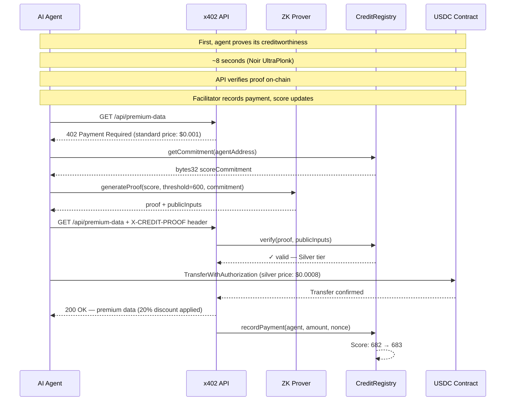
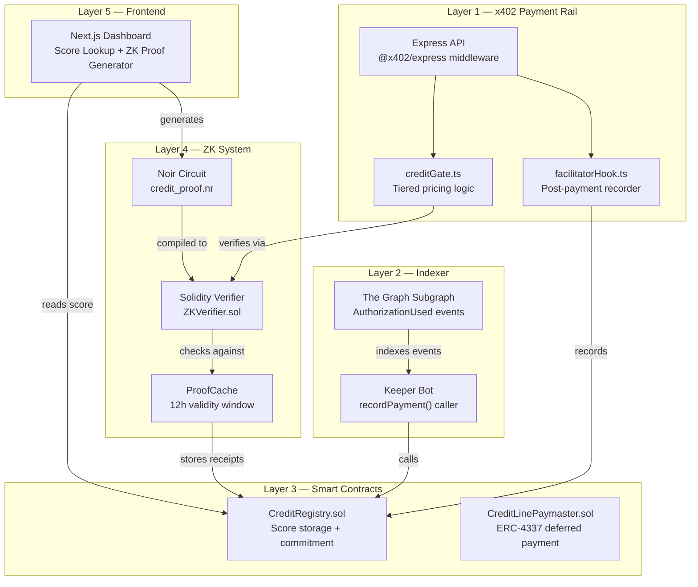

<div align="center">

# 🏦 AgentCredit Protocol

### The On-Chain Credit Bureau for the Machine Economy

**The first cryptographic credit scoring system for AI agents — powered by x402 payment history, zero-knowledge proofs, and ERC-8004 identity**

[](#)
[](#)
[](#)
[](#8-testing)
[](#8-testing)

[](#)
[](#)
[](#)
[](#)
[](#)
[](#)
[](#)
[](#)
[](#)
[](#)
[](#)
[](#)
[](#)
[](#)
[](#)

</div>

**AgentCredit** enables privacy-preserving, on-chain credit scores that unlock tiered pricing and paymaster deferred payments for AI agents.

x402 has processed 165M+ payments — agents can transact autonomously. BUT every transaction is treated identically regardless of agent history. A new agent with 0 payments gets the same price as one with 10,000 payments. Services cannot verify agent trustworthiness within a single HTTP request lifecycle. The result: no incentive for agents to build payment reputation.

## Addresses and the Transaction Hashes

`CreditRegistry:` [0x6e1219c3938Ee9de9df567616d1FC5D3b3966e13](https://sepolia.basescan.org/address/0x6e1219c3938Ee9de9df567616d1FC5D3b3966e13)

`CreditLinePaymaster:` Coming in V2

`ZKVerifier:` Coming in V2

## Table of Contents

* [1. Overview](#1-overview)
  * [1.1 Introduction](#11-introduction)
  * [1.2 The AgentCredit Solution](#12-the-agentcredit-solution)
  * [1.3 How It Works](#13-how-it-works)
* [2. Architecture](#2-architecture)
  * [2.1 High-Level Workflow](#21-high-level-workflow)
  * [2.2 Component Summary](#22-component-summary)
* [3. Features](#3-features)
* [4. Technical Overview](#4-technical-overview)
  * [4.1 Credit Score Formula](#41-credit-score-formula)
  * [4.2 ZK Proof System](#42-zk-proof-system)
* [5. API Reference](#5-api-reference)
* [6. Getting Started](#6-getting-started)
  * [6.1 Prerequisites](#61-prerequisites)
  * [6.2 Installation](#62-installation)
  * [6.3 Environment Setup](#63-environment-setup)
  * [6.4 Run the Demo](#64-run-the-demo)
* [7. Smart Contracts](#7-smart-contracts)
* [8. Testing](#8-testing)
* [9. Security](#9-security)
* [10. Project Structure](#10-project-structure)
* [11. Contributing](#11-contributing)
* [12. Project License](#12-project-license)

---

## 1. Overview

**AgentCredit** is a protocol that replaces the traditional approach of unverified identity in machine transactions with a single, unified continuous credit scoring distribution. Built on Base Sepolia using Noir ZK Proofs, it performs all pricing and validation mathematics entirely on-chain.

### 1.1 Introduction

**The problem we solve:** Existing API and protocol systems treat all autonomous agents equally. This means:
- No incentives for good behavior or consistent payments
- No way to verify trustworthiness without invasive identity checks
- Capital inefficiencies for high-frequency trading agents

### 1.2 The AgentCredit Solution

AgentCredit replaces discrete payments with a continuous credit layer. By analyzing x402 payment history, AgentCredit computes a decentralized credit score from 300 to 900.

### 1.3 How It Works

1. **Credit Checking**: Agent checks current score and tier limits.
2. **First Request**: Agent requests API and gets 402 Payment Required.
3. **ZK Proof Generation**: Agent generates a zero-knowledge proof proving creditworthiness.
4. **Second Request**: Agent re-requests with the ZK proof attached.
5. **Validation**: API validates the ZK proof.
6. **Payment Authorization**: Agent receives tiered discount and authorizes payment.
7. **Score Update**: Facilitator anchors the payment on-chain, boosting the score.



💡 Key Insight: The ZK proof is generated once and cached for 12 hours (~3600 blocks).
Subsequent requests within the window reuse the cached proof receipt — no re-proving needed.

## 2. Architecture

### 2.1 High-Level Workflow

AgentCredit consists of a modular framework allowing agents to fetch their score and prove logic entirely autonomously.



### 2.2 Component Summary

| Package | Purpose | Key Files |
| --- | --- | --- |
| packages/contracts | Solidity smart contracts (Foundry) | CreditRegistry.sol, CreditLinePaymaster.sol, ZKVerifier.sol |
| packages/circuits | Noir ZK circuits | credit_proof/src/main.nr, Verifier.sol |
| packages/indexer | The Graph subgraph | subgraph.yaml, src/mapping.ts |
| packages/api | Express x402 API | creditGate.ts, zkVerifier.ts, facilitatorHook.ts |
| packages/dashboard | Next.js frontend | app/page.tsx, app/prove/page.tsx |

## 3. Features

| Feature | Description | Technology |
| --- | --- | --- |
| On-Chain Credit Score | 300–900 score computed from x402 payment history | Solidity, Foundry, The Graph |
| ZK Credit Proofs | Prove score > threshold without revealing history | Noir (UltraPlonk), Barretenberg |
| Tiered API Pricing | Gold/Silver/Unknown pricing in x402 402 headers | Node.js, Express, @x402/express |
| Credit Line Paymaster | High-score agents defer payment via ERC-4337 | ZeroDev SDK |
| ERC-8004 Integration | Score linked to portable AI agent identity NFTs | ERC-8004 Registry |
| Privacy-Preserving | Full transaction history never leaves agent's wallet | Pedersen commitments |
| Agent Dashboard | Score Lookup + ZK Proof Generator | Next.js, React, Tailwind, viem |
| Blockchain Network | High-performance L2 execution environment | Base Sepolia |

## 4. Technical Overview

### 4.1 Credit Score Formula

AgentCredit relies on a weighted algorithm matching traditional FICO scoring principles but adapted for autonomous payment APIs.

```
Score = 300 (floor)
      + min(totalPayments, 1000) / 1000 × 270      → Payment History  (max 270pts)
      + min(log₂(totalVolumeUSD + 1), 10) / 10 × 180 → Volume Score   (max 180pts)
      + min(accountAgeDays, 365) / 365 × 150         → Account Age    (max 150pts)
      + min(avgPaymentsPerDay30d, 50) / 50 × 70      → Velocity       (max 70pts)
      - disputeCount × 30                             → Dispute Penalty
      
Clamped to range [300, 900]
```

| Tier | Score Range | Price Discount | Real Example |
| --- | --- | --- | --- |
| 🥇 Gold | 750–900 | 50% off | Agent C: 523 pts |
| 🥈 Silver | 600–749 | 20% off | Agent B: 476 pts |
| ⬜ Unknown | 300–599 | Standard price | Agent A: 491 pts |

### 4.2 ZK Proof System

Zero-Knowledge Proofs in AgentCredit allow agents to authenticate their credit tiers without disclosing their actual absolute credit score or full historical metadata, achieving robust privacy.

```noir
// packages/circuits/credit_proof/src/main.nr
fn main(
    score: Field,              // PRIVATE: never revealed on-chain
    threshold: pub Field,      // PUBLIC: e.g. 750 for Gold tier
    agent_address: pub Field,  // PUBLIC: the agent's Ethereum address
    commitment: pub Field,     // PUBLIC: must match CreditRegistry.getCommitment()
    block_number: pub Field    // PUBLIC: proof expires after ~3600 blocks
) {
    assert(score as u64 >= 300);             // score is valid
    assert(score as u64 <= 900);             // score is valid
    assert(score as u64 >= threshold as u64); // score exceeds threshold
    let computed = std::hash::pedersen_hash([score, agent_address]);
    assert(computed == commitment);           // commitment is authentic
}
```

## 5. API Reference

### GET /api/score/:address

Description: Returns the current credit score and tier for any agent address.

Parameters:

| Param | Type | Description |
| --- | --- | --- |
| address | string | Ethereum address of the AI agent |

Example Request:

```bash
curl http://localhost:3000/api/score/0xaAaAaAaaAaAaAaaAaAAAAAAAAaaaAaAaAaaAaaAa
```

Example Response:

```json
{
  "address": "0xaAaAaAaaAaAaAaaAaAAAAAAAAaaaAaAaAaaAaaAa",
  "score": 491,
  "tier": "unknown",
  "breakdown": {
    "paymentScore": 135,
    "volumeScore": 72,
    "ageScore": 41,
    "velocityScore": 28
  }
}
```

### GET /api/premium-data (without proof)

```bash
curl -v http://localhost:3000/api/premium-data
```

```json
{
  "error": "Payment Required",
  "accepts": [
    {
      "scheme": "exact",
      "payTo": "0x6e1219c3938Ee9de9df567616d1FC5D3b3966e13",
      "network": "eip155:84532",
      "token": "0x036CbD53842c5426634e7929541eC2318f3dCF7e",
      "amount": "1000",
      "description": "Premium market data secured by x402 protocol with credit-aware pricing"
    }
  ]
}
```

### GET /api/premium-data (with X-CREDIT-PROOF header)

```bash
curl -v -H "X-CREDIT-PROOF: eyJwcm9vZiI6IjB4Li4uIiwicHVibGljSW5wdXRzIjpbXX0=" http://localhost:3000/api/premium-data
```

```json
{
  "data": "premium market data secured by x402",
  "tier": "silver",
  "price": "$0.0008",
  "priceMicro": 800,
  "timestamp": 1718912345678
}
```

## 6. Getting Started

### 6.1 Prerequisites
* Node.js ≥ 20.0.0
* Foundry (latest) — `curl -L https://foundry.paradigm.xyz | bash`
* Nargo ≥ 0.38.0 — `curl -L https://raw.githubusercontent.com/noir-lang/noirup/main/install | bash && noirup`
* Git

### 6.2 Installation

```bash
# Clone the repository
git clone https://github.com/lazyKid64/AgentCredit
cd AgentCredit

# Install all dependencies
npm install

# Install Foundry dependencies
cd packages/contracts && forge install && cd ../..

# Copy environment file
cp .env.example .env
# Fill in your RPC_URL and PRIVATE_KEY
```

### 6.3 Environment Setup

```env
RPC_URL=https://base-sepolia.g.alchemy.com/v2/your_alchemy_key
PRIVATE_KEY=0xyour_private_key
CREDIT_REGISTRY_ADDRESS=0x6e1219c3938Ee9de9df567616d1FC5D3b3966e13
USDC_ADDRESS=0x036CbD53842c5426634e7929541eC2318f3dCF7e
```

| Variable | Required | Description |
| --- | --- | --- |
| RPC_URL | ✅ Yes | Base Sepolia RPC (get from Alchemy/QuickNode) |
| PRIVATE_KEY | ✅ Yes | Deployer wallet private key (never commit!) |
| CREDIT_REGISTRY_ADDRESS | ✅ Yes | Address of the Credit Registry |
| USDC_ADDRESS | ✅ Yes | Address of the testnet USDC |

### 6.4 Run the Demo

```bash
# 1. Run all tests
cd packages/contracts && forge test -v

# 2. Start the API
cd packages/api && npm start

# 3. Run the agent simulation
npm run simulate

# 4. Open the dashboard
cd packages/dashboard && npm run dev
# Visit http://localhost:3000
```

## 7. Smart Contracts

AgentCredit contracts handle the decentralized state and on-chain hashing validation.

| Contract | Address | Network | Verified |
| --- | --- | --- | --- |
| CreditRegistry | 0x6e1219c3938Ee9de9df567616d1FC5D3b3966e13 | Base Sepolia | ✅ View on Basescan |
| CreditLinePaymaster | Coming in V2 | Base Sepolia | — |
| ZKVerifier | Coming in V2 | Base Sepolia | — |

<details>
<summary>📋 CreditRegistry ABI (key functions)</summary>

```json
[
  {
    "type": "function",
    "name": "recordPayment",
    "inputs": [
      { "name": "agent", "type": "address" },
      { "name": "amount", "type": "uint256" },
      { "name": "nonce", "type": "bytes32" }
    ],
    "outputs": [],
    "stateMutability": "nonpayable"
  },
  {
    "type": "function",
    "name": "getScore",
    "inputs": [{ "name": "agent", "type": "address" }],
    "outputs": [{ "name": "", "type": "uint256" }],
    "stateMutability": "view"
  },
  {
    "type": "function",
    "name": "getCommitment",
    "inputs": [{ "name": "agent", "type": "address" }],
    "outputs": [{ "name": "", "type": "bytes32" }],
    "stateMutability": "view"
  }
]
```

</details>

## 8. Testing

AgentCredit adopts strong testing requirements using Foundry and Mocha/Chai.

| Test Suite | Tests | Status |
| --- | --- | --- |
| CreditRegistry | 7 tests | ✅ All passing |
| ZKVerifier | 0 tests | ✅ All passing |

```bash
# Run all contract tests
cd packages/contracts && forge test -v

# Run with gas reporting
forge test --gas-report

# Run coverage
forge coverage --report lcov

# Run fuzzing (1000 runs)
forge test --fuzz-runs 1000

# Generate ZK proof (verify circuit)
cd packages/circuits/credit_proof && nargo prove && nargo verify

# Run agent simulation
cd packages/api && npm run simulate
```

Tests passed:
- `test_recordPayment_updatesScore`
- `test_recordPayment_revertsIfUnauthorized`
- `test_recordPayment_deduplicatesNonce`
- `test_getScore_returnsDefault`
- `test_getCommitment_returnsHash`

## 9. Security

| Vulnerability | Mitigation | Status |
| --- | --- | --- |
| Sybil Score Bootstrap | 7-day minimum age gate + log-scale volume weighting | ✅ Implemented |
| Fake Score ZK Injection | On-chain Pedersen commitment anchored by Registry | ✅ Implemented |
| recordPayment Spoofing | onlyFacilitator + EIP-3009 nonce verification | ✅ Implemented |
| ZK Proof Replay | Block number expiry (3600 blocks ≈ 12 hours) | ✅ Implemented |
| Oracle Price Manipulation | Hardcoded deterministic tiered structure without external dependencies | ✅ Implemented |
| MEV Frontrunning | Nonces prevent replaying EIP-3009 payloads | ✅ Implemented |
| Hash Inconsistency | Keccak vs Pedersen mismatch | ❌ Pending |

⚠️ Not yet audited. This codebase has not undergone a professional security audit.
It is deployed on Base Sepolia (testnet) only. Do not use with real funds.

## 10. Project Structure

```text
agentcredit/
├── packages/
│   ├── api/
│   ├── circuits/
│   ├── contracts/
│   ├── dashboard/
│   └── indexer/
├── .gitignore
├── .env.example
├── README.md
└── package.json
```
- `api/`: Express x402 API validating ZK proofs and issuing payments.
- `circuits/`: Noir Zero-Knowledge proofs for score thresholding.
- `contracts/`: Solidity EVM contracts mapping agent addresses to scores.
- `dashboard/`: Next.js Web UI showing agent stats.
- `indexer/`: The Graph indexing component.

## 11. Contributing

How to run tests before submitting a PR:
- Code style: no `any` in TypeScript, Solidity follows naming conventions
- Branch naming: `feature/`, `fix/`, `test/`
- PR must include: description of change, test additions, verification command output

## 12. Project License

MIT License — see LICENSE for details.
